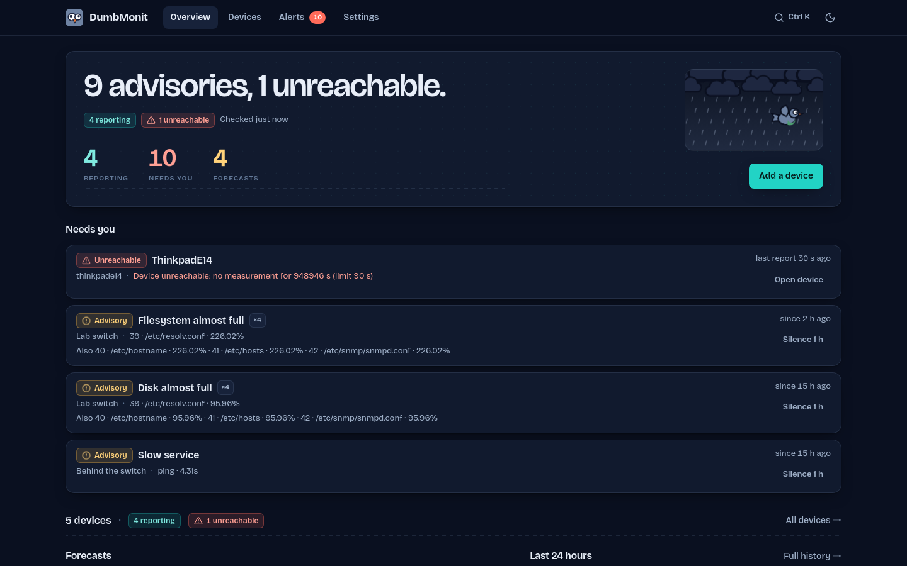
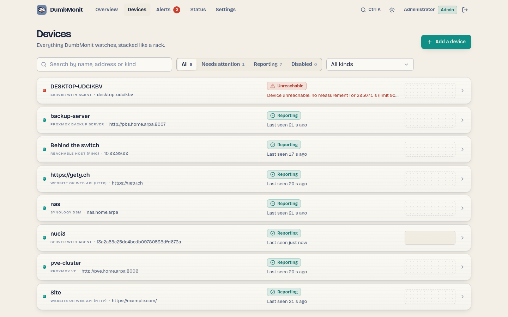
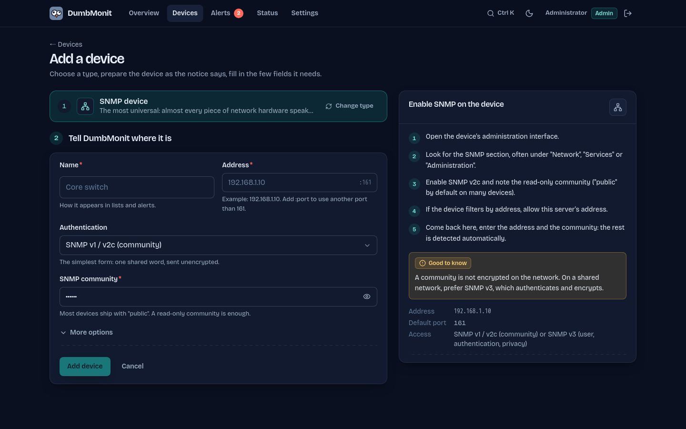
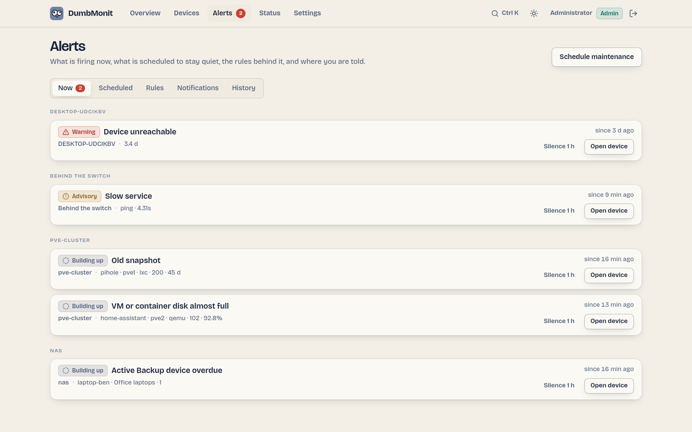
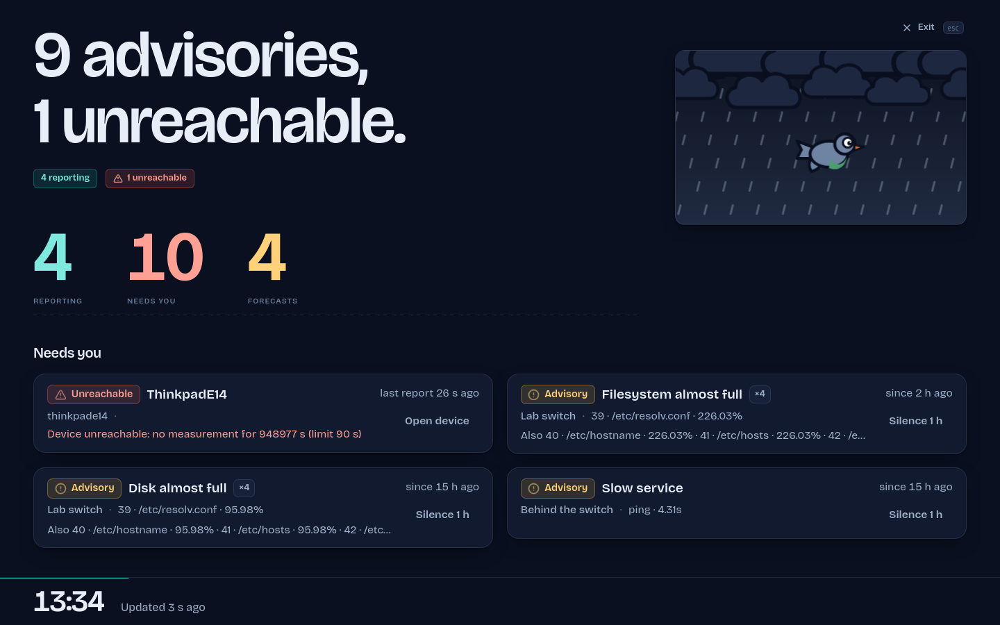
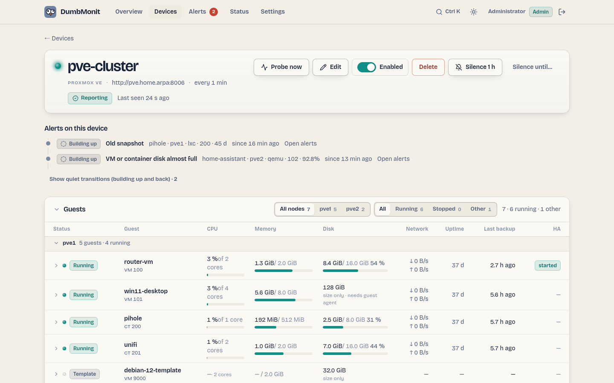
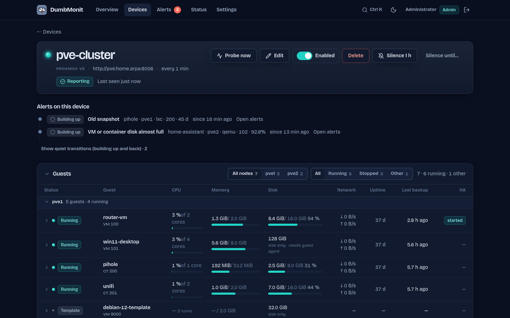

<div align="center">


# DumbMonit

**Dumb-simple monitoring from the homelab to the small business.**

One container, one IP address to type in, useful graphs and alerts in under a minute.<br>
The UI reads like a weather bulletin for your network. The mascot is a pigeon.

[](https://github.com/laupernoe/dumbmonit/actions/workflows/ci.yml)
[](https://dumbmonit.readthedocs.io/en/latest/)
[](https://hosted.weblate.org/engage/dumbmonit/)
[](LICENSE)
[](#quick-start)
[](#status)

**[Live demo](https://demo.dumbmonit.app)** · **[Website](https://dumbmonit.app)** · **[Documentation](https://dumbmonit.readthedocs.io/en/latest/)**



</div>

> **Alpha for early testers.** Expect rough edges and breaking changes;
> feedback and bug reports are very welcome. See [Status](#status).

## Why

- **The one-second answer.** The home screen says "Clear skies." or "1 unreachable,
  4 building up." before anything else. Open it once a day, or from a
  notification, and know whether everything is fine.
- **One way to add anything.** Pick a type, read the notice on the right about
  what to prepare on the device, fill the few fields that matter. SNMP profiles
  are detected on their own.
- **Quiet by default.** Useful rules are active right after install, a switch
  going down sends one notification instead of thirty, and anomaly detection
  learns your network's rhythm before it says anything.

For people who watch ten machines and three switches and do not want to run
Zabbix or Checkmk, nor assemble Prometheus + Grafana + Alertmanager. 100 % open
source under Apache 2.0, dependencies included: no feature is held back for a
paid edition.

## Quick start

```bash
mkdir dumbmonit && cd dumbmonit
curl -fsSLO https://raw.githubusercontent.com/laupernoe/dumbmonit/main/docker-compose.yml
docker compose up -d
```

1. Open http://localhost:8080.
2. Create the first admin account with the one-time code printed by
   `docker compose logs dumbmonit`.
3. Follow the three steps on the overview: add a device, connect a notification
   channel, send a test message.

Good to know:

- **Port 8080 busy?** `DUMBMONIT_PORT=8099 docker compose up -d`.
- **Update:** `docker compose pull && docker compose up -d`.
- **Back up** *Settings → Backup* **and** `/data/secret.key`: without the key,
  stored device credentials cannot be decrypted.
- **Lost password, Docker details, running from source:** see the
  [installation guide](https://dumbmonit.readthedocs.io/en/latest/install/docker/).

Machines that do not speak SNMP get the **agent**: create a token in
*Settings → Agents* and paste the install command the UI shows. It works on
Linux, macOS, FreeBSD and Windows, and checks the binary's SHA-256 before
installing. See [the agent guide](https://dumbmonit.readthedocs.io/en/latest/devices/agent/).

## What it watches

- **Network and servers** — SNMP v1/v2c/v3 (switches, routers, NAS, UPS,
  printers), the agent (CPU, memory, disks, services, temperatures, SMART, ZFS,
  Docker), Redfish server hardware, Active Directory.
- **Virtualisation, backup and storage** — Proxmox VE, Backup Server, Datacenter
  Manager and Mail Gateway, VMware vSphere, Hyper-V, Synology, TrueNAS, Unraid,
  Veeam, restic/Borg.
- **Firewalls and edge** — OPNsense, pfSense, FortiGate, Sophos, MikroTik, UniFi,
  Tailscale, WireGuard, Traefik, Caddy, Nginx, Apache.
- **Self-hosted apps** — Nextcloud, Immich, Paperless-ngx, Jellyfin, Plex,
  Pi-hole, AdGuard Home, Home Assistant, GitLab, Forgejo, Kubernetes, databases
  and message brokers.
- **Services and sites** — HTTP, TCP, DNS, ping, TLS certificates, NTP, SMTP,
  PostgreSQL, MySQL, MQTT, WebSocket, heartbeats (dead man's switch), website
  change detection.
- **Anything else** — network discovery, and **integration packs**: a device kind
  declared in one YAML file, with no release needed.

Every integration, with what it reads and what it needs, is in
[the documentation](https://dumbmonit.readthedocs.io/en/latest/).

## What it does with it

- **Alerting that does not cry wolf** — default rules, parent/child
  suppression, grouping by host, maintenance windows, hysteresis, quiet hours,
  forecasts ("disk full in 9 days") and a seasonal baseline with nothing to
  tune. Acknowledge, snooze, ignore or dismiss an alert in one click.
- **22 notification channels** — Discord, Slack, Teams, Telegram, Matrix, ntfy,
  Gotify, Pushover, PagerDuty, Opsgenie, email and a webhook among them.
- **A security score** per device, from the vendor's own best practices.
- **Public status pages** with history, incidents, email subscribers and badges.
- **Wall mode** for a room monitor: a living Paris rooftop with the pigeons, an
  OLED theme, and Spotify Connect so the screen is also a speaker.
- **Open API and MCP server** — ask Claude or ChatGPT "is everything fine?", or
  read it from the Prometheus and Grafana you already run.
- **Accounts** with roles, TOTP, OIDC single sign-on, and an audit log.
- **Encrypted backup and restore** of the whole configuration.
- **Remote sites** through a relay agent, outbound only, no VPN.
- **Translatable** — see [Contributing](#contributing).

## What it looks like

| | |
|:-:|:-:|
|  |  |
| Devices, stacked like a rack | Add a device: type, notice, relevant fields only |
|  |  |
| Alerts, grouped by host | Wall mode for a room monitor |
|  |  |
| Proxmox VE: every guest at a glance | The same page, dark theme |

More screenshots, in both themes, in [`.github/assets/screenshots/`](.github/assets/screenshots/).

## What runs

One container, one volume: a Rust server with the web UI embedded, the
VictoriaMetrics binary it starts for time series (or your own, through
`DUMBMONIT_VM_URL`), and SQLite for configuration. About 40 MB of RAM plus
256 MB for VictoriaMetrics by default. Every setting is an optional environment
variable, listed in the
[configuration reference](https://dumbmonit.readthedocs.io/en/latest/reference/configuration/).
The image is `ghcr.io/laupernoe/dumbmonit` (`latest` = last release, `edge` =
last commit on `main`).

Adding an integration means implementing the `Collector` trait
(`crates/proto/src/collector.rs`) and registering it; the UI is data-driven, so
a new kind needs no UI release. See [CONTRIBUTING.md](CONTRIBUTING.md).

## Documentation

The user guide lives at **[dumbmonit.readthedocs.io](https://dumbmonit.readthedocs.io)**:
installation, every source and notification channel, alerting, the agent, and
the HTTP API.

## Roadmap

What is planned, in progress and recently shipped is on the public
**[DumbMonit Roadmap](https://github.com/users/laupernoe/projects/2)**. Priorities
can change; suggest an idea by opening an issue.

## Contributing

Bug reports, device profiles and new integrations are welcome. Read
[CONTRIBUTING.md](CONTRIBUTING.md) for the development setup (Docker only, no
Rust toolchain needed), the conventions, and how to add a collector or a
notification channel. Design rules for the UI are in [DESIGN.md](DESIGN.md) and
the product principles in [PRODUCT.md](PRODUCT.md).

The web UI can be **translated on [Weblate](https://hosted.weblate.org/engage/dumbmonit/)**,
no code needed: pick a language, translate, and Weblate opens the pull request.
The language picker (*Settings → Appearance*) lists English, French, German,
Spanish, Italian, Portuguese (Portugal and Brazil), Russian and Simplified
Chinese; only the Settings page is translated so far, the rest follows as strings
move into the message files.

Please report security issues privately: see [SECURITY.md](SECURITY.md).
This project follows the [Contributor Covenant](CODE_OF_CONDUCT.md).

## Status

**Alpha.** DumbMonit runs daily on the author's own network, but the HTTP API
is not frozen, the database schema still moves, there is no upgrade guarantee
across schema changes, and some integrations have only met simulated devices.
Known gaps and bugs are in the [issues](https://github.com/laupernoe/dumbmonit/issues).
Formerly called EzyMonit: the `EZYMONIT_*` variables and the old agent install
are still accepted and migrated.

## License

Apache 2.0 — see [LICENSE](LICENSE).
