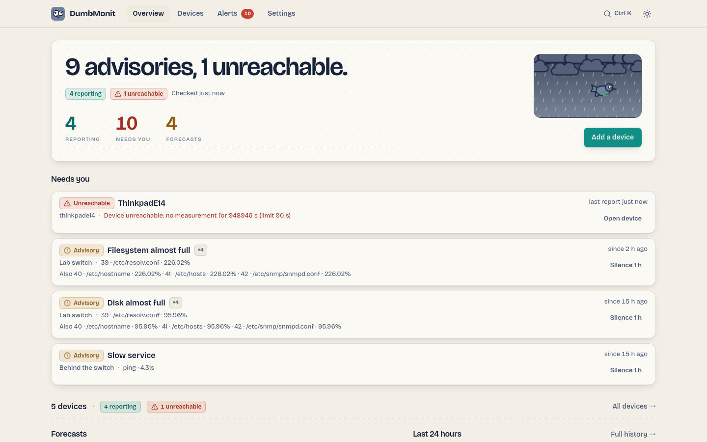

# DumbMonit {#dumbmonit}

Простой мониторинг: от домашней лаборатории до малого бизнеса. Один контейнер, один IP-адрес
для ввода, полезные графики и оповещения меньше чем за минуту.

!!! warning "Работа в процессе"
    DumbMonit активно разрабатывается; текущий образ
    (`ghcr.io/laupernoe/dumbmonit:latest`) — это альфа-версия для первых тестировщиков. До первого
    релиза возможны шероховатости и изменения, ломающие совместимость.

DumbMonit читает сеть как **метеосводку**: главная страница в одном предложении
описывает «небо» («Ясно.» или «2 предупреждения, 1 недоступно.») и
перечисляет то, что требует вашего внимания, — раньше всего остального. Уровни серьёзности следуют
метеорологической шкале (info → advisory → warning), предсказания — это прогнозы, а окна
обслуживания — плановые.

{ loading=lazy }

<a href="install/docker/">Установка<small>Docker Compose, первый запуск, резервные копии</small></a>
<a href="install/first-device/">Добавьте первое устройство<small>SNMP, сканирование сети, что будет дальше</small></a>
<a href="alerting/">Оповещения<small>Встроенные правила, тишина по умолчанию</small></a>

## Что отслеживается {#what-it-watches}

| Источник | Что вы получаете |
|---|---|
| [SNMP v1 / v2c / v3](devices/snmp.md) | Коммутаторы, маршрутизаторы, NAS, ИБП, принтеры. Пять профилей поставляются с продуктом и применяются автоматически по `sysObjectID` устройства. Сканирование сети добавляет сразу всё, что отвечает. |
| [Proxmox VE](devices/proxmox.md) | Узлы, виртуальные машины и контейнеры, хранилища, кворум кластера и возраст последней успешной резервной копии каждой машины. |
| [Proxmox Backup Server](devices/pbs.md) | Заполненность хранилищ данных и прогноз заполнения, дедупликация, возраст и проверка последнего снимка каждой машины, неудачные задачи, сборка мусора. |
| [Synology DSM](devices/synology.md) | Тома, диски и их состояние SMART, температура, нагрузка — через веб-API NAS. |
| [Агент для Linux, macOS, FreeBSD и Windows](devices/agent.md) | ЦП, память, диски, сеть, службы, контейнеры и время работы машин, не поддерживающих SNMP, а также температуры, состояние дисков (SMART) и пулы ZFS, если машина их предоставляет. Устанавливается одной командой или в виде образа Docker; в [режиме ретранслятора](install/remote-site.md) опрашивает устройства удалённой площадки, используя только исходящие соединения. |
| [Сервисы](devices/services.md) | HTTP(S), TCP-порт, DNS, ping и срок действия TLS-сертификата в стиле Uptime Kuma, с полосой истории и процентом доступности. |
| [Пакеты интеграций](packs/index.md) | Тип устройства, описанный в одном YAML-файле — HTTP API или страница Prometheus `/metrics` на устройстве — со своими правилами оповещений, устанавливается без выпуска новой версии сервера. |

## Поговорите с ним {#talk-to-it}

- [Ассистент через MCP](using/assistant.md) — Claude Code, Claude Desktop,
  ChatGPT, VS Code, Cursor — с 27 инструментами: токен `read` только смотрит (статус,
  устройства, оповещения, метрики, агенты, контейнеры…), токен `write` может и действовать
  (заглушать, подтверждать, добавлять устройство, перезапускать контейнер, публиковать инцидент
  на странице статуса). Секреты никогда не возвращаются.
- [HTTP API](reference/api.md), на котором держится всё, что делает UI; описан по адресу
  `/api/openapi.json` (OpenAPI 3.1). Токены (`dmt_…`) бывают с правами на чтение или
  запись, могут истекать, ограничиваться списком сетей и
  имеют лимит запросов.

## Что запущено {#what-runs}

| Контейнер | Роль | Потребление |
|---|---|---|
| `dumbmonit` | Сбор данных, API, оповещения, веб-интерфейс и встроенная VictoriaMetrics для временных рядов | ~40 МБ ОЗУ + бюджет VictoriaMetrics (по умолчанию 256 МБ) |

Один контейнер, один том: сервер запускает VictoriaMetrics из того же
образа, а конфигурация и состояние хранятся во встроенной базе SQLite. Контейнера
с базой данных нет. Вместо встроенной можно использовать внешнюю VictoriaMetrics
(`DUMBMONIT_VM_URL`).

!!! note "Об имени"
    До сентября 2026 года DumbMonit назывался EzyMonit. Вместе с ним были переименованы команды, переменные
    окружения, имена образов и пути; старые переменные
    `EZYMONIT_*` и токены агентов `ezym_` по-прежнему принимаются. См.
    [Обновление](install/docker.md#upgrading).

DumbMonit — это 100% открытое ПО под лицензией Apache 2.0, включая зависимости:
ни одна функция не припасена для платной редакции.
