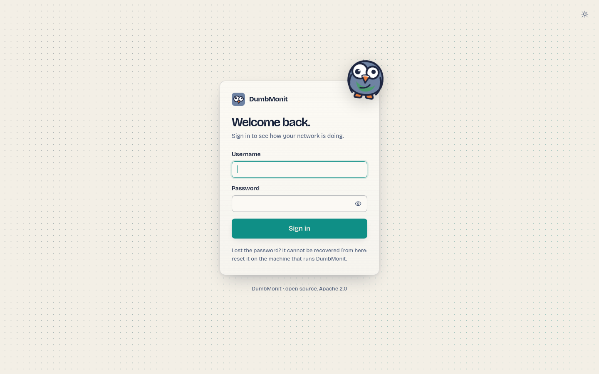

# Instalar com Docker {#install-with-docker}

O DumbMonit corre num único contentor: o servidor `dumbmonit` (recolha, API,
alertas, UI web) inicia o seu próprio VictoriaMetrics para armazenar as séries
temporais; o binário vem na imagem. A configuração e o estado vivem numa base de
dados SQLite integrada. Um volume, `/data`, contém a base de dados, o segredo da
instância e as séries temporais.

!!! note "Imagem alfa"
    `ghcr.io/laupernoe/dumbmonit:latest` é a última compilação alfa etiquetada (amd64;
    as imagens arm64 estão suspensas por agora); `:edge` segue o último commit em `main`. Para correr a partir do código-fonte,
    `docker compose up -d --build` compila a mesma imagem localmente (cerca de dez
    minutos da primeira vez; só é necessário o Docker).

## Pré-requisitos {#prerequisites}

- Docker Engine com o plugin Compose (`docker compose version` funciona).
- Uma máquina que consiga alcançar os dispositivos que quer monitorizar. Não precisa
  de ser alcançável por eles, exceto no caso dos [agentes](../devices/agent.md), que enviam
  as suas medições para o servidor por HTTP.
- Porta `8080` livre no anfitrião, ou outra porta à sua escolha (veja abaixo).

## O ficheiro Compose {#the-compose-file}

Este é o `docker-compose.yml` do repositório; guarde-o numa pasta
própria:

```yaml
# Um contentor: o servidor DumbMonit corre o seu próprio VictoriaMetrics (integrado na
# imagem) e guarda tudo num único volume. Para usar um VictoriaMetrics externo,
# defina DUMBMONIT_VM_URL e o integrado não é iniciado.
name: dumbmonit

services:
  dumbmonit:
    # `docker compose up -d` obtém a imagem publicada (última versão; use
    # `:edge` para o último commit em main). Para compilar a partir deste clone,
    # execute `docker compose up -d --build`: o resultado fica etiquetado com o mesmo nome
    # e passa a ser usado daí em diante.
    image: ghcr.io/laupernoe/dumbmonit:latest
    build: .
    ports:
      # A porta do anfitrião é configurável: a 8080 é uma porta muito disputada numa
      # máquina de homelab. `DUMBMONIT_PORT=8099 docker compose up -d` muda-a.
      - "${DUMBMONIT_PORT:-8080}:8080"
    volumes:
      # Base de dados SQLite, segredo da instância e séries temporais (/data/vm).
      #
      # O servidor corre como utilizador 65532 (não root). Um volume nomeado criado pelo
      # Docker herda esse dono da imagem: nada a fazer. Um bind mount
      # (`./data:/data`) ou um volume criado antes desta alteração tem de ser entregue
      # uma vez:
      #   docker run --rm -v dumbmonit-data:/data alpine chown -R 65532:65532 /data
      # ou, para manter os ficheiros como estão, execute o contentor como o respetivo dono
      # com `user: "1000:1000"` (qualquer uid serve: a imagem não tem /etc/passwd).
      - dumbmonit-data:/data
    environment:
      # Descomente para definir o segredo você mesmo em vez de deixar o DumbMonit
      # gerá-lo em /data/secret.key. Cifra as credenciais dos dispositivos: perdê-lo
      # significa voltar a introduzir cada uma delas.
      # DUMBMONIT_SECRET: replace-me-with-32-random-characters
      # Palavra-passe perdida: `DUMBMONIT_RESET_PASSWORD=1 docker compose up -d` apaga
      # a palavra-passe no arranque e a UI pede uma nova; depois arranque de novo
      # sem a variável.
      DUMBMONIT_RESET_PASSWORD: ${DUMBMONIT_RESET_PASSWORD:-}
      # VictoriaMetrics integrado: retenção (meses, ou p. ex. 30d / 2y) e o
      # orçamento de memória das suas caches. Um homelab com algumas dezenas de dispositivos cabe em
      # 256 MB; aumente-o quando monitorizar centenas de máquinas.
      DUMBMONIT_VM_RETENTION: ${DUMBMONIT_VM_RETENTION:-12}
      DUMBMONIT_VM_MEMORY: ${DUMBMONIT_VM_MEMORY:-256MB}
      # VictoriaMetrics externo em vez do integrado:
      # DUMBMONIT_VM_URL: http://victoriametrics:8428
    # Privilégio mínimo: nenhuma capability, sem escalada de privilégios e o
    # sistema de ficheiros da imagem só de leitura — /data (volume) e /tmp (tmpfs) são os
    # únicos locais graváveis. Os monitores ICMP «ping» também não precisam de capability: o
    # sysctl abaixo permite ao servidor (sem privilégios) abrir sockets ICMP echo dentro
    # do espaço de nomes de rede do próprio contentor. Remova-o se nunca usar ping.
    cap_drop:
      - ALL
    security_opt:
      - no-new-privileges:true
    read_only: true
    tmpfs:
      - /tmp
    sysctls:
      net.ipv4.ping_group_range: "0 2147483647"
    # O servidor para o VictoriaMetrics depois de si: dê-lhe tempo para o fazer.
    stop_grace_period: 30s
    restart: unless-stopped

volumes:
  dumbmonit-data:
    # Nome fixo, independente do nome do projeto compose: o volume é o que
    # se copia e o que uma atualização tem de voltar a encontrar.
    name: dumbmonit-data
```

Depois, arranque-o:

```bash
docker compose up -d
```

!!! tip "Compilar a imagem você mesmo"
    `docker compose up -d` obtém a imagem publicada e ignora `build: .`.
    A partir de um clone do repositório, `docker compose up -d --build` compila a
    mesma imagem localmente (cerca de dez minutos a frio; não é necessária nenhuma
    toolchain Rust ou Node no anfitrião). Use-o para correr a partir do código-fonte ou de um
    ramo.

## VictoriaMetrics integrado {#embedded-victoriametrics}

A imagem contém o binário do VictoriaMetrics (`/victoria-metrics-prod`, de
`victoriametrics/victoria-metrics:v1.152.0`). Quando `DUMBMONIT_VM_URL` não está
definida, o servidor inicia-o como processo filho a escutar em `127.0.0.1:8428`,
guarda as suas séries em `/data/vm`, reencaminha as suas linhas de registo para o seu próprio registo,
reinicia-o com espera progressiva se morrer e para-o no encerramento. Nada é
publicado: a porta fica dentro do contentor.

Vale a pena conhecer duas variáveis: `DUMBMONIT_VM_RETENTION` (`12` meses por
omissão; `30d` ou `2y` também funcionam) e `DUMBMONIT_VM_MEMORY` (`256MB`, o
orçamento das suas caches; aumente-o para centenas de máquinas). O resto está na
[referência de configuração](../reference/configuration.md#embedded-victoriametrics).

Para usar um VictoriaMetrics que já tenha, defina `DUMBMONIT_VM_URL` com o seu
endereço (`http://host:8428`): o integrado deixa então de ser iniciado e
`/data/vm` fica vazio.

## Primeiro arranque {#first-start}

Abra `http://<o-seu-anfitrião>:8080`. Uma instância nova mostra o ecrã `/setup`,
onde cria a primeira conta de administrador (palavra-passe de pelo menos 12
caracteres).

O ecrã pede primeiro o **código de configuração**. Enquanto não existir nenhum administrador,
o servidor imprime um código de utilização única nos registos ao arrancar:

```sh
docker compose logs dumbmonit | grep -A1 "setup code"
```

```
  First-run setup code: K7XQ4-M9PRT
```

Prova que quem cria a conta de administrador controla o servidor, para que outra
pessoa na rede não possa reclamar primeiro uma instância nova. O código existe apenas
em memória, muda a cada reinício até existir um administrador, e as tentativas
erradas têm limitação de taxa. Numa implementação automatizada, defina
`DUMBMONIT_SETUP_CODE` para o escolher você mesmo.

{ loading=lazy }

Depois adicione o seu primeiro dispositivo: veja [Adicionar o primeiro dispositivo](first-device.md).

## Variáveis de ambiente {#environment-variables}

Tudo passa por variáveis de ambiente; nenhuma é obrigatória.

| Variável | Valor por omissão | Função |
|---|---|---|
| `DUMBMONIT_BIND` | `0.0.0.0:8080` | Endereço de escuta dentro do contentor. |
| `DUMBMONIT_DATA_DIR` | `/data` | Base de dados SQLite (`dumbmonit.db`), segredo da instância (`secret.key`) e dados do VictoriaMetrics integrado (`vm/`). |
| `DUMBMONIT_VM_URL` | *(não definida)* | URL de um VictoriaMetrics externo. Quando definida, o integrado não é iniciado. |
| `DUMBMONIT_VM_RETENTION` | `12` | Retenção do VictoriaMetrics integrado: meses, ou `30d`, `2y`. |
| `DUMBMONIT_VM_MEMORY` | `256MB` | Orçamento de memória das caches do VictoriaMetrics integrado. |
| `DUMBMONIT_VM_LISTEN` | `127.0.0.1:8428` | Endereço de escuta do VictoriaMetrics integrado, dentro do contentor. |
| `DUMBMONIT_SECRET` | *(gerado)* | Segredo da instância que cifra as credenciais dos dispositivos e os tokens. |
| `DUMBMONIT_MAX_CONCURRENT_PROBES` | `64` | Sondagens simultâneas, todos os coletores combinados. |
| `DUMBMONIT_PROBE_TIMEOUT_SECS` | `10` | Duração máxima de uma sondagem. |
| `DUMBMONIT_FLUSH_INTERVAL_SECS` | `5` | Período de escrita para o VictoriaMetrics. |
| `DUMBMONIT_LOG` | `info` | Filtro de registo (sintaxe `tracing`, p. ex. `debug`, `dumbmonit=trace`). |
| `DUMBMONIT_AGENT_DIR` | `/agents` | Binários dos agentes servidos em `/download/…`. |
| `DUMBMONIT_RESET_PASSWORD` | *(vazia)* | Defina como `1` para apagar a palavra-passe e todas as sessões no arranque. |
| `DUMBMONIT_SETUP_CODE` | *(gerado)* | Código de configuração pedido por `/setup` enquanto não existir administrador. Se não definido, é impresso um aleatório nos registos em cada arranque. |
| `DUMBMONIT_COOKIE_SECURE` | *(desativado)* | Defina como `1` atrás de um proxy inverso TLS para marcar o cookie de sessão como `Secure`. |
| `DUMBMONIT_ALERT_INTERVAL_SECS` | `30` | Período de avaliação dos alertas (nunca inferior a 10). |
| `DUMBMONIT_ALERT_HISTORY_DAYS` | 90 dias | Retenção do histórico de alertas. Veja a [referência de configuração](../reference/configuration.md) para uma ressalva sobre a sua unidade. |
| `DUMBMONIT_BACKUP_ENABLED` | ativado | Cópias de segurança locais agendadas da base de dados em `/data/backups/`. `DUMBMONIT_BACKUP_DIR`, `_INTERVAL_HOURS` (24) e `_KEEP` (7) ajustam-nas; veja [Cópia de segurança e restauro](backup.md). |

A lista completa, com detalhes, está na [referência de configuração](../reference/configuration.md).
Os nomes `EZYMONIT_*` anteriores à mudança de nome continuam a ser lidos como alternativa; veja
[Atualização](#upgrading).

## Copiar a chave secreta {#back-up-the-secret-key}

As comunidades SNMP, as palavras-passe e os tokens de API são cifrados com AES-256-GCM usando uma
chave derivada do segredo da instância. No primeiro arranque, o DumbMonit gera este
segredo em `/data/secret.key` (dentro do volume `dumbmonit-data`).

!!! danger "Copie `secret.key` em conjunto com a base de dados"
    Sem ele, as credenciais dos dispositivos são irrecuperáveis: uma base de dados restaurada
    sozinha dá uma instância que não consegue comunicar com nada. O servidor deteta uma
    chave em falta ou alterada no arranque e recusa continuar com uma mensagem
    explícita, em vez de falhar silenciosamente em cada sondagem. As cópias de segurança agendadas
    copiam-no por si — veja [Cópia de segurança e restauro](backup.md).

Se preferir ser dono do segredo, defina `DUMBMONIT_SECRET` no ficheiro Compose
(32 caracteres aleatórios ou mais). Guarde-o no seu gestor de palavras-passe.

## Atualização {#upgrading}

```bash
docker compose pull
docker compose up -d
```

As migrações da base de dados correm no arranque. Os dados do VictoriaMetrics não são tocados.

!!! tip "Faça primeiro uma cópia de segurança"
    **Definições → Cópia de segurança → Copiar agora** escreve em poucos segundos uma cópia consistente da base de dados
    e de `secret.key` em `/data/backups/`, e é a partir dela que
    restaura se a atualização correr mal. Veja
    [Cópia de segurança e restauro](backup.md).

### A partir da 0.1.0-alpha.1 {#from-010-alpha1}

Desde a 0.1.0-alpha.2 o contentor corre como utilizador 65532 em vez de root. Um
volume criado pela alpha.1 ainda pertence ao root, e o servidor recusa-se a
arrancar (`/data is not writable by the server`). Entregue o volume uma vez:

```bash
docker compose down
docker run --rm -v dumbmonit-data:/data alpine chown -R 65532:65532 /data
docker compose up -d
```

Ou mantenha os ficheiros como estão e execute o contentor como o respetivo dono, com
`user: "0:0"` (ou o uid de um bind mount) no serviço, em
`docker-compose.yml`.

### A partir do EzyMonit e da configuração de dois contentores {#from-ezymonit-and-from-the-two-container-setup}

O DumbMonit chamava-se EzyMonit até setembro de 2026, e corria em dois contentores,
o servidor e um serviço `victoriametrics` separado. A atualização exige mover uma vez os dados
do projeto antigo para o novo volume. O projeto antigo chamava-se
`ezymonit` (os seus volumes `ezymonit_ezymonit-data` e `ezymonit_vm-data`;
`docker volume ls` confirma). A partir da pasta antiga:

```bash
docker compose down
```

Depois, com o novo `docker-compose.yml`:

```bash
docker volume create dumbmonit-data
docker run --rm -v ezymonit_ezymonit-data:/from -v dumbmonit-data:/to alpine cp -a /from/. /to/
docker run --rm -v ezymonit_vm-data:/from -v dumbmonit-data:/to alpine sh -c 'mkdir -p /to/vm && cp -a /from/. /to/vm/'
docker compose up -d
```

A antiga pasta de dados do VictoriaMetrics tem a estrutura que o integrado usa:
nada a converter. A alternativa é manter o VictoriaMetrics externo e
apontar `DUMBMONIT_VM_URL` para ele.

O que o servidor trata sozinho no primeiro arranque:

- As variáveis `EZYMONIT_*` continuam a ser lidas como alternativa, com um aviso de arranque
  por variável (`EZYMONIT_X is deprecated, use DUMBMONIT_X`).
- `/data/ezymonit.db` é renomeado para `dumbmonit.db`.
- Os tokens de agente `ezym_…` continuam a funcionar; os novos são `dmon_…`. Os agentes continuam
  a enviar; volte a executar o comando de instalação em cada máquina quando for conveniente, ele
  [migra o serviço antigo no local](../devices/agent.md#upgrade).
- O cookie de sessão mudou de nome: todos iniciam sessão de novo uma vez. A preferência
  de tema do navegador é preservada.

O que não trata: o prefixo das métricas mudou de `ezymonit_` para
`dumbmonit_` sem compatibilidade. As séries antigas ficam no VictoriaMetrics com
o nome antigo e expiram com a retenção; os gráficos e as regras integradas recomeçam
na atualização. As regras de alerta personalizadas que referem métricas `ezymonit_…` têm de ser
editadas.

## Cópia de segurança e restauro {#backup-and-restore}

Um volume nomeado, `dumbmonit-data`, contém tudo:

| Caminho | Conteúdo |
|---|---|
| `dumbmonit.db` | Dispositivos, regras, canais, estado dos alertas, sessões. |
| `secret.key` | O segredo da instância. |
| `backups/` | As cópias de segurança locais agendadas: uma cópia da base de dados e do segredo, diária por omissão, sete mantidas. |
| `vm/` | Séries temporais do VictoriaMetrics (12 meses de retenção por omissão). |

O DumbMonit faz cópias da sua própria base de dados de forma agendada, e exporta toda a
configuração — dispositivos, credenciais, regras, canais — num único ficheiro
cifrado com uma frase-passe à sua escolha, que se restaura numa instância nova.
Ambos estão em **[Cópia de segurança e restauro](backup.md)**, juntamente com o que fazer antes de
uma atualização e a única regra sobre `secret.key` que vale a pena ler duas vezes.

Para arquivar o próprio volume, gráficos incluídos, pare a stack e crie um tar:

```bash
docker compose stop
docker run --rm -v dumbmonit-data:/data -v "$PWD:/backup" alpine \
  tar czf /backup/dumbmonit-data.tgz -C /data .
docker compose start
```

Para restaurar, crie o volume, extraia o arquivo para dentro dele da mesma forma e depois
`docker compose up -d`.

Se o espaço importar, `--exclude=./vm` mantém o arquivo pequeno: a base de dados e
o segredo são a configuração, `vm/` são apenas os gráficos.

## Mudar a porta {#changing-the-port}

Defina `DUMBMONIT_PORT` ao arrancar:

```bash
DUMBMONIT_PORT=8099 docker compose up -d
```

Ou ponha `DUMBMONIT_PORT=8099` num ficheiro `.env` junto ao ficheiro Compose.

## Proxy inverso {#reverse-proxy}

A UI e a API são servidas numa só porta em HTTP simples. Não se usa WebSocket:
a interface consulta a API periodicamente, pelo que qualquer proxy inverso funciona sem configuração
especial.

=== "Caddy"

    ```
    monit.example.com {
        reverse_proxy 127.0.0.1:8080
    }
    ```

=== "nginx"

    ```nginx
    server {
        listen 443 ssl;
        server_name monit.example.com;
        # ssl_certificate / ssl_certificate_key …

        location / {
            proxy_pass http://127.0.0.1:8080;
            proxy_set_header Host $host;
            proxy_set_header X-Forwarded-Proto $scheme;
            # Os agentes enviam lotes de recuperação após uma interrupção:
            client_max_body_size 16m;
        }
    }
    ```

Quando o proxy termina o TLS, defina `DUMBMONIT_COOKIE_SECURE: "1"` para que o cookie de
sessão só seja enviado por HTTPS. Não o defina numa implementação em HTTP simples: o
navegador nunca devolveria o cookie e o início de sessão seria impossível.

!!! note "Agentes atrás de um proxy"
    O comando de instalação mostrado ao criar um token de agente usa o URL que o seu
    navegador usou para chegar à UI. Se for o URL do proxy, os agentes usá-lo-ão
    também: certifique-se de que `/install.sh`, `/install.ps1`, `/download/…` e `/api/ingest`
    passam pelo proxy.

## Corre como utilizador sem privilégios {#runs-as-a-non-root-user}

O contentor corre o servidor como utilizador `65532:65532` (numérico: a imagem `scratch`
não tem `/etc/passwd`), com todas as capabilities retiradas, `no-new-privileges`
e um sistema de ficheiros raiz só de leitura; `/data` (o volume) e `/tmp` (um tmpfs)
são os únicos caminhos graváveis. Tudo isto está no ficheiro Compose acima.

Um volume nomeado criado pelo Docker no primeiro arranque herda o dono de `/data`
da imagem: nada a fazer. Dois casos precisam de um comando:

- **Um volume criado por uma versão anterior** (o servidor corria como root,
  pelo que os ficheiros pertencem ao root). Entregue-os uma vez, com a stack parada:

  ```bash
  docker compose stop
  docker run --rm -v dumbmonit-data:/data alpine chown -R 65532:65532 /data
  docker compose up -d
  ```

  O sintoma, caso contrário, é um contentor que termina logo com
  `creating directory /data … Permission denied` (ou `unable to open database
  file`).

- **Um bind mount** (`./data:/data`) mantém o dono da pasta do anfitrião.
  Ou `chown -R 65532:65532 ./data`, ou execute o contentor como o dono
  da pasta: `user: "1000:1000"` no serviço, qualquer uid serve.

## Ping ICMP sem capability {#icmp-ping-without-a-capability}

O [monitor de ping](../devices/services.md#ping) envia ecos ICMP. Em vez de
um socket raw — que precisa de `NET_RAW`, e uma capability concedida a um utilizador de contentor
sem privilégios não é utilizável de qualquer modo — usa um socket ICMP echo, que o Linux
permite aos grupos listados em `net.ipv4.ping_group_range`. O ficheiro Compose
define esse sysctl dentro do espaço de nomes de rede do próprio contentor:

```yaml
    sysctls:
      net.ipv4.ping_group_range: "0 2147483647"
```

Nada muda no anfitrião. O Docker 20.10 e posteriores definem este intervalo em todos os
contentores por si; as linhas explícitas garantem-no em motores mais antigos
e no Podman. Sem ele, a verificação reporta um erro de configuração (mostrado no
dispositivo, não notificado), nunca um falso «anfitrião em baixo». Com `docker run`, passe
`--sysctl net.ipv4.ping_group_range="0 2147483647"`.

## Testar sem hardware {#testing-without-hardware}

Adicione um [dispositivo de demonstração](../devices/demo.md): produz medições falsas sem
nada para preparar, pelo que os gráficos, as regras e as notificações podem ser experimentados
de imediato. Para dados SNMP reais, a máquina que corre o Docker muitas vezes chega — instale
o `snmpd` nela (`apt install snmpd`, permita a comunidade `public` na bridge do Docker
em `/etc/snmp/snmpd.conf`) e adicione um dispositivo SNMP com o endereço do anfitrião
nessa bridge (`172.17.0.1` por omissão): o perfil é detetado
automaticamente e aparecem interfaces, memória e processos.

Os programadores podem adicionar a sobreposição `docker-compose.dev.yml` para publicar o VictoriaMetrics
integrado no `:8428` do anfitrião para consultas MetricsQL diretas:

```bash
docker compose -f docker-compose.yml -f docker-compose.dev.yml up -d
```
