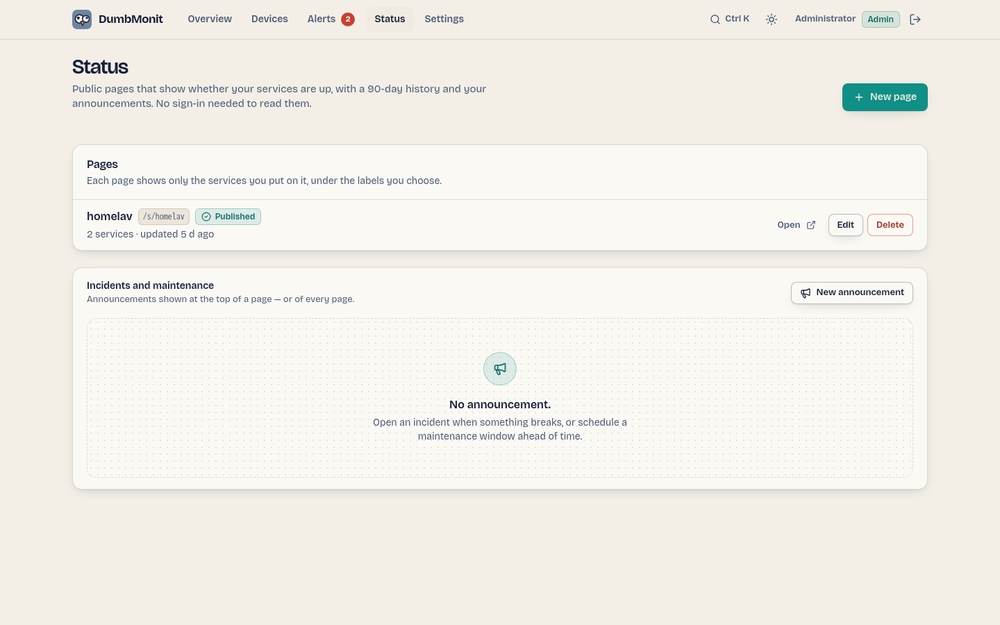

# Status pages

{ loading=lazy }

A status page is the public face of your monitoring: a page anyone can open —
no sign-in, no cookie — that says whether your services are up, shows up to 90 days
of daily history for each of them, carries your incident and maintenance
announcements, and lets visitors follow them by RSS or email. Badges put the
same answer in a README; a compact view fits in an intranet page.

It only shows what you put on it: the label you give each service, its state,
its uptime and its response time. Device names, addresses, types and
identifiers never leave the server — not in the page, not in a badge, not in
an email.

## 1. Create a page

**Status** in the top bar → **New page**. That page lists your status pages
(open, edit, delete) with the announcements under them; the editor opens on
its own route (`/status/new`, `/status/<id>`). The public rendering is at
`/s/<address>`.

| Field | What it does |
| --- | --- |
| **Title** | The heading of the page ("Home lab"). |
| **Address** | The last part of the URL, `/s/<address>`. Suggested from the title; lowercase letters, digits and hyphens, 2 to 40 characters. |
| **Description** | One sentence under the title. Optional. |
| **Theme** | Day, night, or follow the visitor's system. |
| **History** | The longest window the history bar covers (30, 60 or 90 days). The bar adapts to the age of the page's data: it shows as many days as the oldest service has been monitored, from 7 days up to this setting. A page never says more than this — see [Badges](#badges). |
| **Simple mode** | A plain page: no scene, no mascot, no animation and no easter eggs. Light or dark follows the visitor's system, with a toggle in the header; the page's Theme setting is ignored. |
| **Published** | Off = draft: the page, its badges and its logo answer "not found" to visitors until you switch it on. |

Then tick the devices to show. For each one, set the **label** visitors will
read (it defaults to the device name — you may prefer "Website" to
"nginx-front-01") and, optionally, a **group** ("Network", "Storage"). Groups
become blocks on the page, in the order you arrange the services.

Save, and the link is ready to copy. The page refreshes itself every minute.

### Look

The **Look** section of the editor dresses the page in your colours without
opening it to arbitrary code:

| Setting | What it does |
| --- | --- |
| **Logo** | PNG, JPEG or WebP, up to 256 KiB, shown next to the title. Square works best. SVG is refused: it can carry script, and the page is served from the same address as the administration. The file is checked by its content, stored under `/data/status-pages/`, and served as an image only. |
| **Accent** | Ink (default), blue, teal, violet, rose or amber — the top rule, the links and the subscribe button. Each one is chosen to stay readable by day and by night. |
| **Organisation website** | An `http://` or `https://` link shown next to the title, as the site's host name. |
| **Footer text** | Plain text under the page, up to 280 characters: who runs it, how to reach them. Line breaks are kept; nothing is interpreted as HTML or Markdown. |

### Scene

The **Scene** setting draws a city skyline behind the banner. New pages start with Paris,
and existing pages that had no scene now show it too; untick it for a plain
banner, or turn on **Simple mode** to drop scenes altogether. Pick as many as you like, in the order you want them. Cities: Venice, Paris,
Tokyo, New York, London, Rome, Sydney, Dubai, San Francisco, Barcelona,
Amsterdam, Istanbul and Rio de Janeiro. The new seven wonders: Chichén Itzá,
Machu Picchu, the Great Wall, Petra and the Taj Mahal (Rio's Christ the
Redeemer is in the Rio scene). The ancient wonders: Giza, Babylon, Ephesus,
Olympia, Halicarnassus, Rhodes and Alexandria, plus the Athens Acropolis. With more than one, **Rotation** decides when the page
moves to the next: at every visit (default), every minute, every ten minutes or
every hour. The scenes are a closed set of drawings shipped with DumbMonit —
nothing is uploaded or interpreted.

There is deliberately no custom CSS or HTML: a status page is public and lives
on the same origin as your admin interface, under the same
[content security policy](../reference/api.md).

## 2. What visitors see

- A banner with the one-second answer, read from the services: **All systems
  operational**, **Partial outage** (some down or degraded), **Major outage**
  (all down) or **Scheduled maintenance**. An open incident while every
  service still answers reads **Incident in progress**, toned by its impact.
- The open announcements, newest update first, with the timeline of updates
  under a fold.
- Each service with its state plate (Operational, Degraded, Down, Maintenance,
  No data), its **history bar** — one square per day — its uptime over 24 h,
  7 days, 30 days and (on a 90-day page) 90 days, and the response time for
  uptime probes.
- **Past incidents**, by day, for the last 30 days.
- **Get updates**: the RSS feed, and an email subscription form when you set
  one up (see [Email subscribers](#email-subscribers)).

### The history bar

Each square is one day (UTC), toned by that day's uptime: full colour at
99.5 % and above, amber from 95 %, red below. **A day without any measurement
is grey**, not green — a service added last week has 83 grey days, not 83
perfect ones. Hover a square, or focus the bar and move with the arrow keys
(Home and End jump to the ends), to read the date, the uptime, the **minutes
of downtime** and the incidents that touched that day. The words are there for
screen readers too: status is never told by colour alone.

How the state is decided:

| State | Meaning |
| --- | --- |
| Operational | The last probe succeeded (uptime probes), or the device reported within three polling periods. |
| Degraded | Up now, but at least one probe failed within the last hour. |
| Down | The last probe failed, the device stopped reporting, or its configuration is in error. |
| Maintenance | A maintenance window is in progress and the service is down: expected, not an outage. Either an announcement on this page, or an alerting [maintenance window](../alerting/maintenance.md) covering that device. |
| No data | Never probed yet, or disabled. |

Uptime for probes (`http`, `tcp`, `dns`, `ping`, `tls`, heartbeats) is the
share of successful checks, from `dumbmonit_probe_success`; a day's downtime is
its failed checks times the probe interval. For other devices (SNMP, agent,
Proxmox…) it is the share of five-minute slots in which the device reported at
least once (`dumbmonit_up`), counted from the first measurement — a device
added yesterday is not "down" for the 89 days before that — and a day's
downtime is its silent slots.

## 3. Announce incidents and maintenance

On the **Status** page, under the list of pages, **Incidents and maintenance**
→ **New announcement** (also ++ctrl+k++ → *Announce an incident*).

- An **incident** has a title, an impact (**minor** shows the page as
  degraded, **major** as an outage) and moves through *Investigating →
  Identified → Monitoring → Resolved*. Post updates as you go: each one carries
  a status and a message, and becomes the latest line visitors read.
  **Resolve** closes it with a final message; it then moves to "Past
  incidents" for 30 days.
- A **maintenance** window has a start and an end and moves through *Scheduled
  → In progress → Completed*. While it is in progress the banner says
  "Scheduled maintenance" and services that are down show as *Maintenance*.

A [maintenance window scheduled in Alerts](../alerting/maintenance.md) does the
same thing for the one device it covers, without an announcement: that service
reads *Maintenance* instead of red while the window is open, and the page's
overall state says *Maintenance* when nothing else is down or degraded. Only
windows that name a device surface this way; the window's name and comment stay
private.

An announcement is shown on one page or on **all pages**.

### Email subscribers

Visitors can subscribe to your announcements by email once you pick an
**email (SMTP) channel** in the editor, under **Email subscribers**. The
channel is one you already configured under
[Notifications](../alerting/notifications.md); its server and sender are reused, its
own recipients are not. Without one, the page offers its RSS feed only.

- **Double opt-in.** A visitor enters an address; DumbMonit mails a
  confirmation link, and nothing else is sent until it is followed. A request
  never confirmed is forgotten after two days. The form answers the same
  sentence whether the address is new, pending or already subscribed, so it
  tells no one who follows your page.
- **What is sent.** An email when an announcement is created, when an update
  is posted, and when its status changes — for incidents and maintenance
  alike, on that page (or on every page, for an announcement shown on all).
- **Unsubscribing.** Every email ends with a link to unsubscribe, and carries
  the `List-Unsubscribe` and `List-Unsubscribe-Post` headers, so Gmail, Apple
  Mail and others offer their own one-click button.
- **Limits.** The public subscribe endpoint accepts five requests per client
  address and sixty in all per 15 minutes, and a pending address is not mailed
  twice within ten minutes: the page cannot be turned into a mail cannon.
- The editor lists subscribers (confirmed or pending) and removes any of them.

The links in these emails point at the page's [custom domain](#custom-domain)
when it has one (`https://status.example.com/`). Otherwise they are built from
the **public URL** of the
[notification policy](../alerting/notifications.md) (or `DUMBMONIT_PUBLIC_URL`); without one, from
the address you used when you last saved the page — never from a visitor's
request.

## 4. Share the link

The page lives at `https://your-server/s/<address>`. Everything under `/s/` and
`/api/public/` is served without authentication; the rest of DumbMonit stays
behind sign-in.

The editor's **Share** panel builds the snippets below for you, with a
preview.

### Badges

Every published page serves SVG badges — flat, with white text on solid
colour, readable on both the light and dark themes of a GitHub README:

| Badge | URL |
| --- | --- |
| Page status | `/api/public/status/<address>/badge.svg` |
| Page uptime | `/api/public/status/<address>/uptime.svg?days=30` |
| Page response time | `/api/public/status/<address>/response.svg` |
| Service status | `/api/public/status/<address>/components/<service>/badge.svg` |
| Service uptime | `/api/public/status/<address>/components/<service>/uptime.svg?days=30` |
| Service response time | `/api/public/status/<address>/components/<service>/response.svg` |

`<service>` is the service's label in URL form: "Public API" becomes
`public-api` (a second "Public API" would be `public-api-2`). It is also the
`key` of each service in the JSON document. `days` is `1`, `7`, `30` (default)
or `90`, and never more than the page's history: a 30-day page refuses a
90-day badge. The page's uptime and response time are the mean over its
services. A service with nothing measured says **no data**, in grey.

In a README:

```markdown
[](https://your-server/s/home-lab)
[](https://your-server/s/home-lab)
[](https://your-server/s/home-lab)
```

Badges are cached for a minute (`Cache-Control: public, max-age=60`), so
GitHub's image proxy and your visitors cost the time-series database nothing.

### Embed

`/s/<address>/embed` is a compact view for an iframe: the overall state and
one line per service with its state and 30 days of history, and a link to the
full page in a new tab.

```html
<iframe src="https://your-server/s/home-lab/embed"
        title="Home lab status" width="100%" height="320" style="border:0"></iframe>
```

Add `?theme=light` or `?theme=dark` to match the host page, and `?history=0`
to hide the bars. The status page and its embed are the only addresses of
DumbMonit a third-party page may frame; everything else (the confirmation and
unsubscribe pages included) answers with `frame-ancestors 'none'` and
`X-Frame-Options: DENY`.

### Custom domain

A page can have its own address, like `status.example.com`, the way Uptime
Kuma does it. Type the name in the editor's **Public domain** field (the
**i** next to it sums up the steps) and save. When a request reaches DumbMonit
with that name in its `Host` header, DumbMonit shows the page at the root `/`,
and nothing else: on that name the sign-in screen, the settings, the API, the
agents' endpoints, the metrics and the other status pages all answer
`404 Not found`, even for someone signed in, and no session cookie is read or
set. Only the page, its embed, its confirmation and unsubscribe pages, its
badges, feed and JSON document, and the interface's own files (`/_app/`,
icons) are served.

The name is stored in lower case, without `https://` or a trailing slash; a
port, a path or an IP address is refused. Two pages cannot share a name, and
the address you use to reach DumbMonit itself (or its public URL) cannot be a
page's domain — saving it would lock you out. Clear the field to remove the
domain; the page stays at `/s/<address>` either way.

To set it up:

1. **DNS.** Create the record for the name (or the public hostname of a
   Cloudflare Tunnel), pointing at your reverse proxy.
2. **Proxy.** Send the name to DumbMonit's address, for example
   `http://dumbmonit:8080`, **without rewriting the path**: the proxy forwards
   `/`, not `/s/<address>`.
3. **Host header.** Pass the original `Host` header on: it is how DumbMonit
   tells the page's domain from its own address. DumbMonit reads only `Host`;
   `X-Forwarded-Host` counts only from a proxy listed in
   `DUMBMONIT_TRUSTED_PROXIES`.
4. **HTTPS** is handled by the proxy. DumbMonit links to
   `https://<domain>/` in subscriber emails, the RSS feed and the editor's
   **Share** panel.

Traefik (Docker labels) — the `Host` header is passed on by default:

```yaml
labels:
  - traefik.enable=true
  - traefik.http.routers.status.rule=Host(`status.example.com`)
  - traefik.http.routers.status.entrypoints=websecure
  - traefik.http.routers.status.tls.certresolver=letsencrypt
  - traefik.http.services.status.loadbalancer.server.port=8080
```

Nginx Proxy Manager — add a **Proxy Host** with the domain
`status.example.com`, scheme `http`, forward hostname `dumbmonit`, port `8080`,
and an SSL certificate. Nothing else: it passes `Host` on by default. Leave
the **Custom locations** empty.

Cloudflare Tunnel — add a **Public hostname** `status.example.com` with the
service `http://dumbmonit:8080` and no path. The tunnel keeps the visitor's
`Host`; leave **HTTP Host Header** in the advanced settings empty.

Caddy — `reverse_proxy` passes `Host` on and Caddy fetches the certificate:

```caddyfile
status.example.com {
    reverse_proxy dumbmonit:8080
}
```

Nginx — `proxy_pass` sends the upstream's name unless told otherwise, so set
the header:

```nginx
server {
    listen 443 ssl;
    server_name status.example.com;
    # ssl_certificate … ;

    location / {
        proxy_pass http://dumbmonit:8080;
        proxy_set_header Host $host;
        proxy_set_header X-Forwarded-For $proxy_add_x_forwarded_for;
        proxy_set_header X-Forwarded-Proto $scheme;
    }
}
```

**Troubleshooting.**

- *The domain shows DumbMonit's sign-in screen or dashboard*: the `Host`
  header did not reach DumbMonit — the proxy replaced it with the upstream's
  name (`dumbmonit:8080`). Add `proxy_set_header Host $host;` (Nginx), remove a
  custom **HTTP Host Header** (Cloudflare Tunnel), or remove a `Host`
  rewrite middleware (Traefik). Nothing private is exposed: the dashboard
  still asks for a password.
- *A bare `Not found` on the domain*: the proxy rewrites the path (it sends
  `/s/<address>` or adds a prefix), or the domain in the editor does not match
  the name in the browser exactly. Forward the path untouched.
- *The page says it does not exist*: the page is still a draft — publish it.
- *You can no longer reach DumbMonit's interface*: you are browsing through
  the page's domain. Use DumbMonit's own address, or clear the page's
  **Public domain**.

### Behind a reverse proxy

A [custom domain](#custom-domain) is the simplest way to expose only the
status page. If you prefer to keep the `/s/<address>` path on a public name,
filter the paths in the proxy instead. With Caddy, for example:

```caddyfile
status.example.com {
    @public path /s/* /api/public/* /_app/* /favicon.svg
    reverse_proxy @public dumbmonit:8080
    respond 404
}
```

With nginx:

```nginx
location ~ ^/(s/|api/public/|_app/|favicon\.svg) {
    proxy_pass http://dumbmonit:8080;
    proxy_set_header Host $host;
    proxy_set_header X-Forwarded-Proto $scheme;
}
location / { return 404; }
```

`/_app/` carries the interface's scripts and styles: the page needs them to
render. Forward `X-Forwarded-Proto` and `X-Forwarded-Host` so that the RSS
feed links to the right address, and set the public URL (see above) so that
subscriber emails do too.

### Feed and document

- `GET /api/public/status/<address>/rss` — an RSS feed of incidents and
  maintenance windows, one item per announcement with its latest update.
- `GET /api/public/status/<address>` — the JSON document the page is built
  from, if you want to build your own: the page's title, description and look,
  the overall state, each service's `key`, `label`, `state`, uptime
  (`uptime_24h`, `uptime_7d`, `uptime_30d`, `uptime_90d`), `latency_ms` and
  `history` (`date`, `uptime_pct`, `down_minutes`, `incidents` per day), and
  the announcements.

The document is cached for 30 seconds on the server; the badges, the feed and
the embed all read that same cached document, so none of them can say more
than the page.
