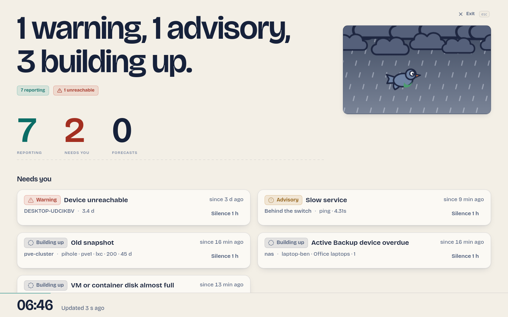

# Wall mode and music

`/wall` shows the bulletin alone, full screen, for a screen that stays on in a
room: the sentence, the weather window, three big readouts and the *Needs you*
list, refreshed every 20 seconds, with the screen kept awake. ++esc++ or
**Exit** returns to the overview. Open it from the command palette ("Wall mode")
or by typing the URL. `?theme=dark` or `?theme=light` forces a light for that
display without touching your saved preference.

{ loading=lazy }

## Music on the wall

The wall can also play music and show what is playing, so that you can start a
playlist from your phone, hear it from the TV, and see it from across the room.
Music always sits in the bottom corner of the weather window, over the sky: it
never takes room from the bulletin or the *Needs you* list, and it disappears
when nothing plays. Each card folds into a small pill (the display remembers
it).

There are two ways, and you can use both.

| | Spotify Connect | A link sent to the walls |
|---|---|---|
| Start it from | the Spotify app on your phone (**Devices → DumbMonit Wall**) | any DumbMonit screen, your phone included (**Play on the wall**) |
| Services | Spotify | Spotify, Deezer, YouTube and YouTube Music |
| Needs | Spotify Premium, a Spotify Developer app of your own, the wall served over HTTPS (or localhost) | nothing; without being signed in on the wall, Spotify and Deezer play 30-second previews |
| Shows what plays | yes, wherever it plays: the wall, a TV's Spotify app, a cast speaker | the service's own player |

Connecting Spotify and sending links are admin actions; a viewer account on the
wall plays and shows everything.

### Spotify Connect: the wall becomes a speaker

1. **Create a Spotify app.** Open the
   [Spotify Developer Dashboard](https://developer.spotify.com/dashboard), create
   an app (any name), tick **Web API** and **Web Playback SDK**, and add the
   redirect URI that **Settings → Wall music** shows:
    - DumbMonit served over HTTPS: `https://<your address>/api/music/spotify/callback`.
      Spotify comes straight back to DumbMonit after you approve.
    - DumbMonit served over plain HTTP: `http://127.0.0.1:8888/callback`.
      Spotify accepts `http://` only for a loopback address (and not
      `localhost`), since 2025. Nothing answers at that address: after you
      approve, your browser shows an error page whose address carries the
      code — copy it and paste it back into DumbMonit.
2. **Connect.** In **Settings → Wall music**, paste the app's **Client ID**
   (there is no secret: DumbMonit uses Authorization Code with PKCE) and choose
   **Connect Spotify**, then approve on Spotify.
3. **On the wall**, tap **Tap to enable sound** once after the page loads:
   browsers keep a page silent until it has been touched.
4. **On your phone**, in the Spotify app, open **Devices** and pick
   **DumbMonit Wall**. The sound comes out of the display.

DumbMonit keeps the Spotify refresh token encrypted with the instance secret
and never sends it to a browser. The wall only receives a short-lived access
token for its player, and only through a signed-in session (an API token cannot
get one). **Disconnect** forgets the account; to also remove DumbMonit from
your Spotify account, use [spotify.com/account/apps](https://www.spotify.com/account/apps/).

What it takes, and what the wall says when something is missing (in its
**Music** panel, top right of the wall):

- **Spotify Premium** on the account. A personal app (Spotify's *development
  mode*) belongs to a Premium account and admits up to five accounts: add others
  under **User Management** in the dashboard.
- **A secure page.** Spotify's player only runs over HTTPS, or on
  `http://localhost` on the display itself. Put DumbMonit behind your reverse
  proxy (Caddy, Traefik, Nginx Proxy Manager…) to use the wall as a speaker on
  another machine.
- **A browser that plays protected audio**: Chrome, Edge, Firefox (allow
  *Play DRM-controlled content*) or Safari on a computer; Chromium with Widevine
  on a Raspberry Pi (`libwidevinecdm0`). Smart-TV browsers usually cannot — plug
  a small computer into the TV instead.
- **One tap per page load**, or a kiosk browser started with
  `--autoplay-policy=no-user-gesture-required`.
- **Reconnect every six months.** Spotify ends a connection six months after it
  was approved; Settings shows the date, and the wall says so when it happens.

**Now playing works without any of that.** DumbMonit's server asks Spotify what
is playing on the account every few seconds (one request for all walls) and the
wall shows the cover, title, artist, progress and the device it plays on — the
wall itself, the Spotify app of a smart TV, a Chromecast, your laptop — even over
plain HTTP and in a browser that cannot play Spotify. To use that alone, switch
off **Use this display as a Spotify speaker** in the wall's Music panel.

### A link sent to every wall

In **Settings → Wall music** (or the wall's own **Music** panel), paste a
Spotify, Deezer or YouTube link to a track, album, playlist, episode or video and
choose **Play on the wall**. Every wall plays it in the service's official
embedded player; a link sent while a wall is open starts by itself where the
service allows it (YouTube, Deezer) once the wall has been tapped. **Stop**
removes it from every wall.

Deezer and YouTube have no Spotify Connect equivalent that a web page can use —
Deezer no longer accepts new developer apps and its API never exposed what is
playing — so a link is the way for them. The embedded players play 30-second
previews unless the wall's browser is signed in to the service.

### Privacy

Nothing third-party loads on the wall until Spotify is connected or a link is
set. The page's content security policy allows exactly the three embedded
players, Spotify's player script (`sdk.scdn.co/spotify-player.js`) and its
frame, and covers from `i.scdn.co` — nothing else, and nothing outside the web
interface.

### API

| Route | Who | What |
|---|---|---|
| `GET /api/music/now` | any session or token | What plays on the Spotify account (cached a few seconds) and the link the walls play |
| `PUT /api/music/link` `{"link": "…"}` | admin | Every wall plays this link |
| `DELETE /api/music/link` | admin | The walls stop the embedded player |
| `GET /api/music/spotify` | any session or token | The connected account: status, Client ID, reconnect-by date — never a token |
| `POST /api/music/spotify/authorize` | admin session | Starts a connection: `{"client_id", "redirect_uri"}` → Spotify's approval URL |
| `POST /api/music/spotify/complete` `{"url": "…"}` | admin session | Finishes a loopback connection with the address the browser landed on |
| `GET /api/music/spotify/callback` | the admin's browser | Spotify's direct redirect (HTTPS installs) |
| `DELETE /api/music/spotify` | admin | Disconnects and forgets the tokens |
| `GET /api/music/spotify/token` | browser session only | A short-lived access token for the wall's player |
